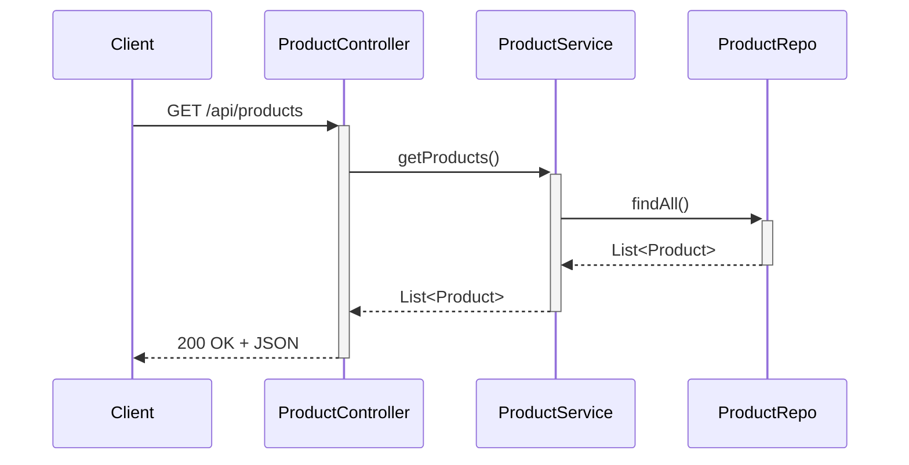

<p align="center">
  
  
  
  
  
  
</p>

<h1 align="center">🛒 spring E-Commerce— Backend API</h1>
<p align="center">
  A <strong>RESTful e-commerce backend</strong> built with Spring Boot 4.1 and PostgreSQL.<br>
  Clean layered architecture. Loosely coupled. Production-ready structure.
</p>

---

## 📋 Overview

eBuy is a full-featured product management API that handles:

- **Full CRUD** — Create, read, update, and delete products
- **Image handling** — Multipart image upload & retrieval as BLOBs
- **Keyword search** — Case-insensitive search across name, brand, description, and category
- **Stock management** — Quantity tracking with checkout integration
- **CORS enabled** — Cross-origin support for SPA frontends

The entire backend is built with **loose coupling** in mind — swap the database, swap the frontend, swap the image storage strategy. Each layer is independently testable and replaceable.

---

## 🏗️ Architecture

```
┌──────────────────────────────────────────────────────┐
│                    REST Client                        │
│          (React SPA / Postman / Mobile App)           │
└──────────────────────┬───────────────────────────────┘
                       │  HTTP / JSON
                       ▼
┌──────────────────────────────────────────────────────┐
│                  Controller Layer                     │
│           ProductController.java                      │
│     ─ Routes requests, validates input, sends         │
│       responses as JSON                               │
└──────────────────────┬───────────────────────────────┘
                       │  Method call
                       ▼
┌──────────────────────────────────────────────────────┐
│                   Service Layer                       │
│            ProductService.java                        │
│     ─ Business logic, image processing,               │
│       transaction management                          │
└──────────────────────┬───────────────────────────────┘
                       │  JPA Repository
                       ▼
┌──────────────────────────────────────────────────────┐
│                  Repository Layer                     │
│             ProductRepo.java (JPA)                    │
│     ─ Database queries, custom JPQL                   │
└──────────────────────┬───────────────────────────────┘
                       │  JDBC
                       ▼
┌──────────────────────────────────────────────────────┐
│                     Database                          │
│               PostgreSQL (springecom)                 │
└──────────────────────────────────────────────────────┘
```

### Request Flow



---

## 🔗 Loose Coupling

Each layer communicates through well-defined interfaces, never through shared state.

| Component | Swap To | Change Required |
|-----------|---------|-----------------|
| Database | MySQL, H2, MariaDB | `application.properties` only |
| Frontend | Any HTTP client | None |
| Image storage | AWS S3, local filesystem | `ProductService` only |
| Business logic | Mocked in unit tests | Zero Spring context needed |

---

## 📌 Tech Stack

| Layer | Technology |
|-------|------------|
| Language | **Java 17** |
| Framework | **Spring Boot 4.1.0** |
| API Layer | Spring Web (REST) |
| ORM | Spring Data JPA / Hibernate |
| Database | PostgreSQL 16 |
| Build Tool | Maven |
| Boilerplate | Project Lombok |
| Testing | JUnit 5 + Spring Boot Starter Test |

---

## 📂 Project Structure

```
SpringEcom/
├── pom.xml
│
├── src/main/java/com/springcourse/springecom/
│   ├── SpringEcomApplication.java          # Entry point
│   │
│   ├── controller/
│   │   ├── ProductController.java          # REST endpoints
│   │   └── model/
│   │       └── Product.java                 # JPA entity
│   │
│   ├── repository/
│   │   └── ProductRepo.java                # JPA repository + custom JPQL
│   │
│   └── service/
│       └── ProductService.java             # Business logic
│
├── src/main/resources/
│   └── application.properties              # Config (DB, JPA, server)
│
└── src/test/java/
    └── SpringEcomApplicationTests.java     # Context load test
```

---

## 🧩 Data Model

| Field | Type | JPA / Notes |
|-------|------|-------------|
| `id` | `Integer` | `@Id`, auto-generated via sequence `my_own_seq` |
| `name` | `String` | Product title |
| `description` | `String` | Product details |
| `brand` | `String` | Manufacturer / brand name |
| `price` | `BigDecimal` | — |
| `category` | `String` | Laptop, Mobile, Fashion, etc. |
| `releaseDate` | `Date` | JSON format `dd-MM-yyyy` |
| `stockQuantity` | `int` | Validated during checkout |
| `productAvailable` | `boolean` | Controls item visibility |
| `imageName` | `String` | Original filename |
| `imageType` | `String` | MIME type (e.g., `image/jpeg`) |
| `imageData` | `byte[]` | `@Lob` — raw image bytes |

---

## 🌐 API Endpoints

All endpoints are prefixed with `/api`. CORS is enabled globally.

| Method | Endpoint | Description | Request |
|--------|----------|-------------|---------|
| `GET` | `/products` | List all products | — |
| `GET` | `/product/{id}` | Get product by ID | Path: `id` |
| `GET` | `/product/{id}/image` | Get product image | Path: `id` |
| `POST` | `/product` | Create a product | Multipart: `product` (JSON) + `imageFile` |
| `PUT` | `/product/{id}` | Update a product | Path: `id` + Multipart |
| `DELETE` | `/product/{id}` | Delete a product | Path: `id` |
| `GET` | `/products/search?keyword=` | Search products | Query: `keyword` |

### Search Implementation

The search endpoint runs a single **case-insensitive JPQL query** across four product fields:

```java
@Query("SELECT p FROM Product p WHERE " +
       "LOWER(p.name) LIKE LOWER(CONCAT('%', :keyword, '%')) OR " +
       "LOWER(p.description) LIKE LOWER(CONCAT('%', :keyword, '%')) OR " +
       "LOWER(p.brand) LIKE LOWER(CONCAT('%', :keyword, '%')) OR " +
       "LOWER(p.category) LIKE LOWER(CONCAT('%', :keyword, '%'))")
List<Product> searchProducByKeyword(String keyword);
```

---

## ⚙️ Configuration

```properties
spring.application.name=SpringEcom
server.port=8080

# PostgreSQL
spring.datasource.url=jdbc:postgresql://localhost:5432/springecom
spring.datasource.username=postgres
spring.datasource.password=your_password_here
spring.datasource.driver-class-name=org.postgresql.Driver

# JPA / Hibernate
spring.jpa.hibernate.ddl-auto=update
spring.jpa.show-sql=true
spring.jpa.properties.hibernate.format_sql=true
spring.datasource.hikari.auto-commit=false
```

Set `ddl-auto` to `validate` in production and use environment variables for credentials.

---

## 🚀 Getting Started

### Prerequisites
- Java 17+
- PostgreSQL 16+ running with a database named `springecom`
- Maven (or use the bundled `mvnw` wrapper)

### Clone & Run

```bash
git clone https://github.com/your-username/ebuy-backend.git
cd SpringEcom
```

**Windows**
```bash
mvnw.cmd spring-boot:run
```

**macOS / Linux**
```bash
./mvnw spring-boot:run
```

The API starts at:
```
http://localhost:8080
```

Verify it's running:
```bash
curl http://localhost:8080/api/products
```

---

## 🧪 Testing

```bash
./mvnw test
```

A context-loading test is included to verify that the Spring container starts correctly with all beans wired.

---

## 🖥️ Frontend

The React SPA (in `ecom-frontend-5/`) was built as part of the **Telusko Spring Boot course** curriculum, with eBay-style UI refinements assisted by an LLM. It runs as a standalone Vite application on port 5173 and communicates with this backend exclusively through REST.

---

## 📸 Screenshots

*Coming soon after deployment.*

---

## 🧠 What This Demonstrates

- Clean **Controller → Service → Repository** layering
- **RESTful API design** with proper HTTP methods and status codes
- **JPA entity mapping** with custom sequence generation
- **Multipart file handling** for image upload
- **Custom JPQL queries** for cross-field search
- **CORS configuration** for SPA compatibility
- **Lombok** for minimal boilerplate
- **Spring Boot 4.1** on **Java 17**

---

## 🚧 Future Improvements

- [ ] Add authentication (JWT / OAuth2)
- [ ] Order management with purchase history
- [ ] Pagination for product listings
- [ ] Input validation with `@Valid`
- [ ] Docker Compose for one-command setup
- [ ] Integration tests with Testcontainers

---

## 🙌 Acknowledgements

- Backend architecture and concepts learned through the **Telusko Spring Boot course**
- Frontend built as part of the course curriculum with LLM-assisted UI enhancements

---

## 👤 Author

**Shubh Dubey**  
GitHub: [@shubhdubey1](https://github.com/shubhdubey1)

---

## 📄 License

This project is open source and available for learning and portfolio purposes.
