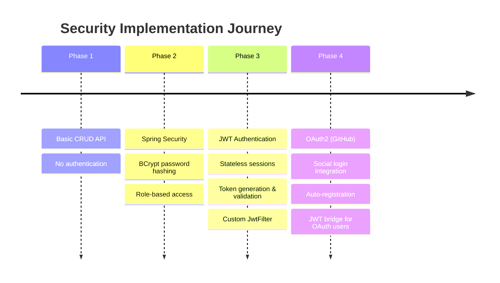
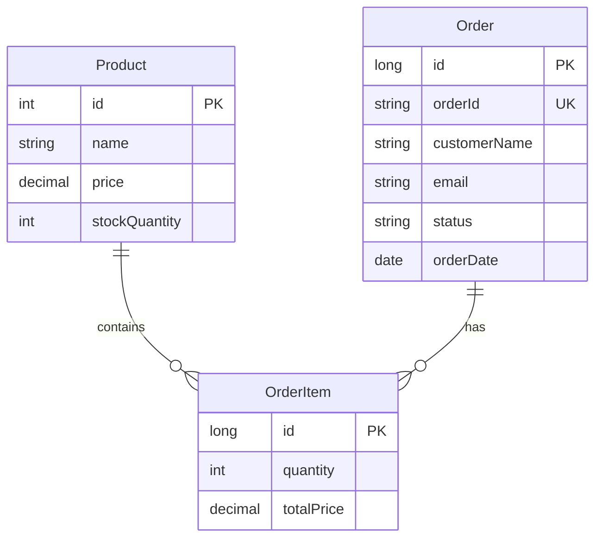
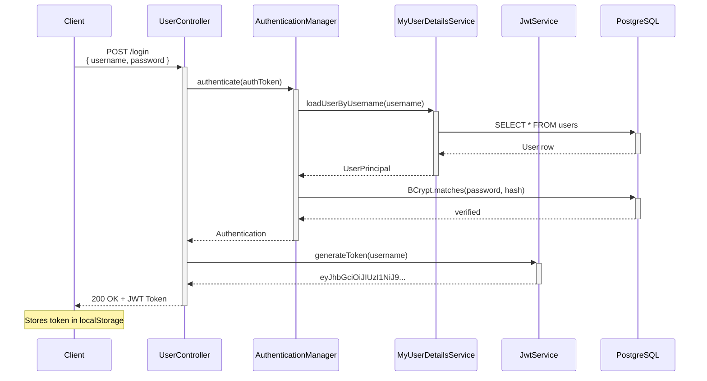
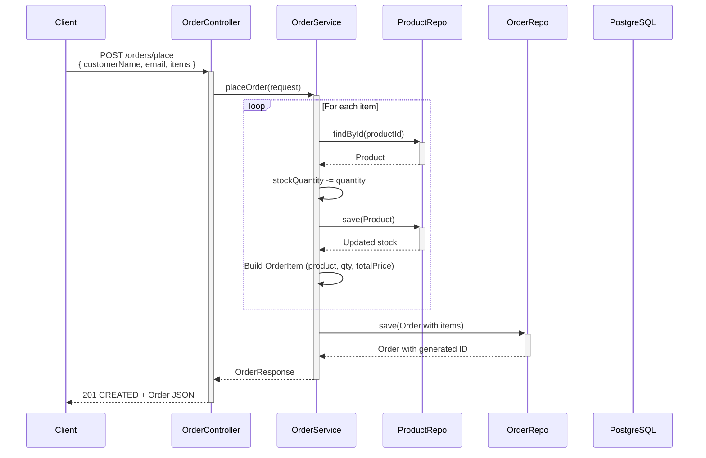

thansks..<p align="center">
  
  
  
  
  
  
  
  
  
</p>

<h1 align="center">ebuy — Full-Stack E-Commerce Platform</h1>
<p align="center">
  A <strong>production-style RESTful e-commerce backend</strong> built with Spring Boot 4.1, PostgreSQL, JPA/Hibernate, and secured with Spring Security, JWT, & OAuth2.<br>
  Layered architecture. Loosely coupled. Security-first design.
</p>

---

## Table of Contents

- [Overview](#overview)
- [Security Evolution](#security-evolution)
- [Architecture](#architecture)
- [Tech Stack](#tech-stack)
- [Project Structure](#project-structure)
- [Data Model](#data-model)
- [API Reference](#api-reference)
- [Authentication Flow](#authentication-flow)
- [Order Flow](#order-flow)
- [Configuration](#configuration)
- [Getting Started](#getting-started)
- [Testing](#testing)
- [Frontend](#frontend)
- [Author](#author)

---

## Overview

**ebuy** is a full-stack e-commerce platform engineered with a **security-first mindset**. What started as a basic CRUD API evolved into a multi-layered authentication system featuring **JWT token-based auth**, **OAuth2 social login via GitHub**, and **BCrypt password hashing** — all integrated into a clean, testable architecture.

### Key Capabilities

| Area | Details |
|------|---------|
| **Product Management** | Full CRUD with multipart image upload (BLOB storage) |
| **Search** | Case-insensitive JPQL search across name, brand, description, and category |
| **Stock Management** | Real-time quantity tracking with checkout validation |
| **Order Processing** | Full order lifecycle with line-item breakdown |
| **Authentication** | JWT-based login + OAuth2 GitHub login + BCrypt encryption |
| **Authorization** | Spring Security filter chain with stateless session management |
| **CORS** | Globally configured for SPA cross-origin requests |

---

## Security Evolution

This project showcases a deliberate, step-by-step security implementation:

```
Phase 1 ──→  Basic CRUD API (no auth)
                │
                ▼
Phase 2 ──→  Spring Security + BCrypt Password Encoding
                │  ├── User registration with encrypted passwords
                │  └── Role-based endpoint protection
                ▼
Phase 3 ──→  JWT Token Authentication
                │  ├── Stateless session management
                │  ├── Token generation on login (/login)
                │  ├── JwtFilter for request validation
                │  └── Token expiration & validation
                ▼
Phase 4 ──→  OAuth2 Social Login (GitHub)
                   ├── OAuth2 authorization flow
                   ├── Auto-create user on first login
                   └── JWT issued post-OAuth success
```



---

## Architecture

The backend follows a strict **Controller → Service → Repository** layered pattern with an additional **Security/Auth layer** that intercepts all requests via the Spring Security filter chain.

```mermaid
graph TD
    Client["REST Client<br/>(React SPA / Postman)"] --> |HTTP Request| CORS[CORS Filter]
    CORS --> JwtFilter[JwtFilter<br/>Token Validation]
    JwtFilter --> |Authenticated| SecurityCtx[Security Context]
    JwtFilter --> |Unauthenticated| AuthEP[/login /register /oauth2]
    SecurityCtx --> Controllers

    subgraph Controllers [Controller Layer]
        PC[ProductController]
        UC[UserController]
        OC[OrderController]
    end

    subgraph Services [Service Layer]
        PS[ProductService]
        US[UserService]
        OS[OrderService]
        JWT[JwtService]
        UDS[MyUserDetailsService]
    end

    subgraph Repos [Repository Layer]
        PR[ProductRepo]
        UR[UserRepo]
        OR[OrderRepo]
    end

    subgraph Security [Security Layer]
        SC[SecurityConfiguration]
        JF[JwtFilter]
        UP[UserPrincipal]
    end

    Controllers --> Services
    Services --> Repos
    Repos --> DB[(PostgreSQL)]
    US --> SC
    JWT --> JF
    UDS --> UP
```

### Request Flow (Authenticated)

```mermaid
sequenceDiagram
    participant C as Client
    participant JF as JwtFilter
    participant SC as SecurityContext
    participant Ctrl as Controller
    participant Svc as Service
    participant Repo as Repository
    participant DB as PostgreSQL

    C->>+JF: GET /products<br/>Authorization: Bearer &lt;token&gt;
    JF->>+JWT: extractUserName(token)
    JWT-->>-JF: username
    JF->>+UDS: loadUserByUsername(username)
    UDS-->>-JF: UserDetails
    JF->>+JWT: validateToken(token, UserDetails)
    JWT-->>-JF: valid
    JF->>SC: setAuthentication(authToken)
    JF->>+Ctrl: forward request
    Ctrl->>+Svc: getProducts()
    Svc->>+Repo: findAll()
    Repo->>+DB: SELECT * FROM product
    DB-->>-Repo: ResultSet
    Repo-->>-Svc: List&lt;Product&gt;
    Svc-->>-Ctrl: List&lt;Product&gt;
    Ctrl-->>-C: 200 OK + JSON
```

---

## Tech Stack

| Layer | Technology |
|-------|------------|
| **Language** | Java 17 |
| **Framework** | Spring Boot 4.1.0 |
| **Security** | Spring Security 6.x, JWT (jjwt 0.11.5), OAuth2 Client |
| **API Layer** | Spring Web (REST) |
| **ORM** | Spring Data JPA / Hibernate |
| **Database** | PostgreSQL 16 |
| **Build Tool** | Maven |
| **Boilerplate** | Project Lombok |
| **Testing** | JUnit 5 + Spring Boot Starter Test |
| **Frontend** | React 18 + Vite + Bootstrap 5 (LLM-assisted UI) |

---

## Project Structure

```
ebuy/
├── SpringEcom/                          # Spring Boot Backend
│   ├── pom.xml
│   └── src/main/java/com/springcourse/springecom/
│       ├── SpringEcomApplication.java   # Entry point
│       ├── config/
│       │   └── SecurityConfiguration.java   # Spring Security, CORS, OAuth2
│       ├── controller/
│       │   ├── ProductController.java   # CRUD + search endpoints
│       │   ├── UserController.java      # Register, Login, Logout
│       │   └── OrderController.java     # Order placement & listing
│       ├── filter/
│       │   └── JwtFilter.java           # OncePerRequestFilter for JWT
│       ├── model/
│       │   ├── Product.java             # JPA entity
│       │   ├── User.java                # User entity
│       │   ├── UserPrincipal.java       # UserDetails implementation
│       │   ├── Order.java               # Order entity
│       │   ├── OrderItem.java           # Order line-item entity
│       │   └── dtos/                    # Request/Response records
│       │       ├── OrderRequest.java
│       │       ├── OrderResponse.java
│       │       ├── OrderItemRequest.java
│       │       └── OrderItemResponse.java
│       ├── repository/
│       │   ├── ProductRepo.java         # JPA + custom JPQL search
│       │   ├── UserRepo.java
│       │   └── OrderRepo.java
│       └── service/
│           ├── ProductService.java      # Business logic
│           ├── UserService.java          # Registration with BCrypt
│           ├── OrderService.java         # Order processing
│           ├── JwtService.java           # Token generation & validation
│           └── MyUserDetailsService.java # UserDetailsService impl
│
├── ebuy-frontend/                       # React SPA
│   ├── package.json
│   └── src/
│       ├── main.jsx
│       ├── App.jsx                      # Route guard (token check)
│       ├── axios.jsx                    # Axios instance with JWT interceptor
│       ├── Context/Context.jsx          # Global state (cart, products)
│       └── components/
│           ├── Auth.jsx                 # Login/Register + GitHub OAuth2 button
│           ├── Navbar.jsx               # Search bar, cart count, logout
│           ├── Home.jsx                 # Product listing with category filter
│           ├── Product.jsx              # Product detail view
│           ├── AddProduct.jsx           # Admin product creation
│           ├── UpdateProduct.jsx        # Admin product editing
│           ├── Cart.jsx                 # Shopping cart management
│           ├── CheckoutPopup.jsx        # Order placement modal
│           ├── Order.jsx                # Order history view
│           └── SearchResults.jsx        # Search results display
```

---

## Data Model

### Product Entity

| Field | Type | Notes |
|-------|------|-------|
| `id` | `Integer` | `@Id`, sequence-generated (`my_own_seq`, start 101) |
| `name` | `String` | Product title |
| `description` | `String` | Product details |
| `brand` | `String` | Manufacturer |
| `price` | `BigDecimal` | — |
| `category` | `String` | Laptop, Mobile, Fashion, etc. |
| `releaseDate` | `Date` | JSON format `dd-MM-yyyy` |
| `stockQuantity` | `int` | Decremented on order placement |
| `productAvailable` | `boolean` | Visibility toggle |
| `imageName` | `String` | Original filename |
| `imageType` | `String` | MIME type (e.g., `image/jpeg`) |
| `imageData` | `byte[]` | `@Lob` BLOB storage |

### Order & OrderItem



### User Entity

| Field | Type | Notes |
|-------|------|-------|
| `id` | `Integer` | `@Id`, sequence-generated (`users_seq`, start 6) |
| `username` | `String` | Unique login identifier |
| `password` | `String` | BCrypt-encoded (empty for OAuth2 users) |

---

## API Reference

### Authentication Endpoints

| Method | Endpoint | Auth Required | Description |
|--------|----------|:---:|-------------|
| `POST` | `/register` | No | Create a new user (BCrypt-hashed password) |
| `POST` | `/login` | No | Authenticate & receive JWT token |
| `POST` | `/logout` | No | Clear security context |
| `GET` | `/oauth2/authorization/github` | No | Initiate GitHub OAuth2 flow |

### Product Endpoints

| Method | Endpoint | Description | Request |
|--------|----------|-------------|---------|
| `GET` | `/products` | List all products | — |
| `GET` | `/product/{id}` | Get product by ID | Path: `id` |
| `GET` | `/product/{id}/image` | Get product image bytes | Path: `id` |
| `POST` | `/product` | Create a product | Multipart: `product` (JSON) + `imageFile` |
| `PUT` | `/product/{id}` | Update a product | Path: `id` + Multipart |
| `DELETE` | `/product/{id}` | Delete a product | Path: `id` |
| `GET` | `/products/search?keyword=` | Search across name, brand, description, category | Query: `keyword` |

### Order Endpoints

| Method | Endpoint | Description | Request |
|--------|----------|-------------|---------|
| `GET` | `/orders` | List all orders | — |
| `POST` | `/orders/place` | Place a new order | JSON: `{ customerName, email, items: [{ productId, quantity }] }` |

> All endpoints except `/register`, `/login`, and `/oauth2/**` require `Authorization: Bearer <jwt_token>` header.

### Search Implementation

```java
@Query("SELECT p FROM Product p WHERE " +
       "LOWER(p.name) LIKE LOWER(CONCAT('%', :keyword, '%')) OR " +
       "LOWER(p.description) LIKE LOWER(CONCAT('%', :keyword, '%')) OR " +
       "LOWER(p.brand) LIKE LOWER(CONCAT('%', :keyword, '%')) OR " +
       "LOWER(p.category) LIKE LOWER(CONCAT('%', :keyword, '%'))")
List<Product> searchProductByKeyword(String keyword);
```

---

## Authentication Flow

### JWT Login



### OAuth2 GitHub Login

```mermaid
sequenceDiagram
    participant C as Client (React)
    participant Backend as SpringEcom
    participant GH as GitHub OAuth
    participant DB as PostgreSQL

    C->>+Backend: GET /oauth2/authorization/github
    Backend-->>-C: Redirect to GitHub
    C->>+GH: User authorizes
    GH-->>-C: Authorization code
    C->>+Backend: Callback with code
    Backend->>+GH: Exchange code for access token
    GH-->>-Backend: Access token
    Backend->>+GH: Fetch user info (/user)
    GH-->>-Backend: { login, email, name }
    alt New user
        Backend->>+DB: INSERT INTO users
    end
    Backend->>+JWT: generateToken(username)
    JWT-->>-Backend: JWT
    Backend-->>-C: Redirect: /products?token=&lt;JWT&gt;&username=
    Note over C: Extracts token from URL,<br/>stores in localStorage
```

---

## Order Flow



---

## Configuration

```properties
spring.application.name=SpringEcom
server.port=8080

# PostgreSQL
spring.datasource.url=jdbc:postgresql://localhost:5432/springecom
spring.datasource.username=postgres
spring.datasource.password=your_password_here
spring.datasource.driver-class-name=org.postgresql.Driver

# JPA / Hibernate
spring.jpa.hibernate.ddl-auto=update
spring.jpa.show-sql=true
spring.jpa.properties.hibernate.format_sql=true
spring.datasource.hikari.auto-commit=false

# File upload
spring.servlet.multipart.max-file-size=30MB
spring.servlet.multipart.max-request-size=30MB

# OAuth2 GitHub
spring.security.oauth2.client.registration.github.client-id=your_client_id
spring.security.oauth2.client.registration.github.client-secret=your_client_secret
```

> **Production note:** Set `ddl-auto` to `validate`, externalize credentials as environment variables, and never commit client secrets.

---

## Getting Started

### Prerequisites

- Java 17+
- PostgreSQL 16+ running with a database named `springecom`
- Maven (or use the bundled `mvnw` wrapper)
- GitHub OAuth App credentials (for social login)

### Setup

```bash
# Clone the repository
git clone https://github.com/shubhdubey1/ebuy.git
cd ebuy

# Configure database & OAuth credentials
# Edit: SpringEcom/src/main/resources/application.properties

# Run the backend
cd SpringEcom
mvnw.cmd spring-boot:run    # Windows
./mvnw spring-boot:run      # macOS / Linux
```

The API starts at `http://localhost:8080`.

### Running the Frontend

```bash
cd ebuy-frontend
npm install
npm run dev
```

The SPA runs at `http://localhost:5173`.

---

## Testing

```bash
cd SpringEcom
./mvnw test
```

Includes a context-loading test that verifies all beans wire correctly.

---

## Frontend

The React SPA is a functional, token-aware client built with **Vite + React 18 + Bootstrap 5**. I designed the **data flow architecture**, **state management strategy** (Context API for cart & products), **authentication integration** (JWT interceptor, OAuth2 redirect handling), and **routing logic** (auth guards, protected routes). The UI components and styling were implemented with assistance from an LLM to accelerate development.

**Key architectural decisions I made:**
- Axios interceptor to attach JWT to every request
- Conditional routing based on token presence in `localStorage`
- Context API for global cart state with `localStorage` persistence
- OAuth2 success handler that bridges GitHub auth to JWT via URL params

---

## Author

**Shubh Dubey**

I'm a backend-focused Java developer passionate about Spring Boot, REST APIs, and clean architecture. This project demonstrates my ability to design and implement a full-stack application with production-grade security — from basic CRUD to multi-layered authentication with JWT and OAuth2.

- GitHub: [@shubhdubey1](https://github.com/shubhdubey1)
