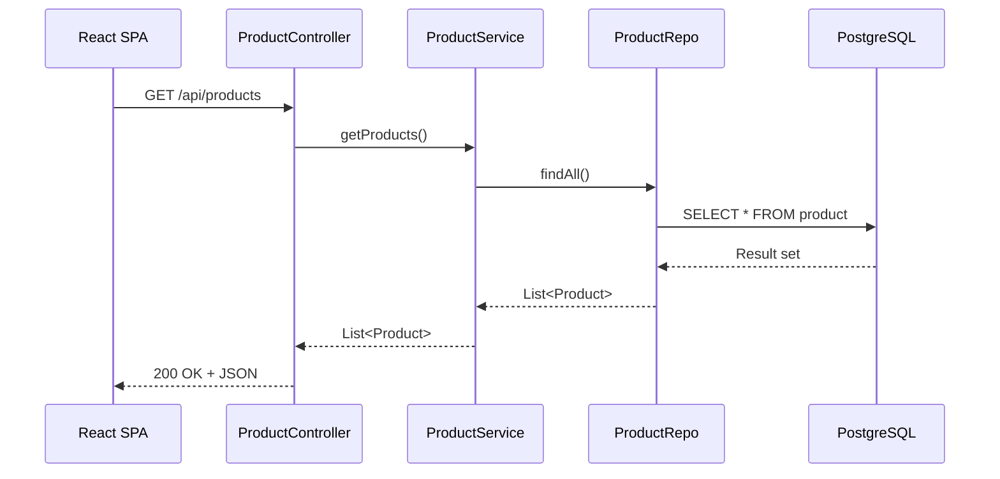
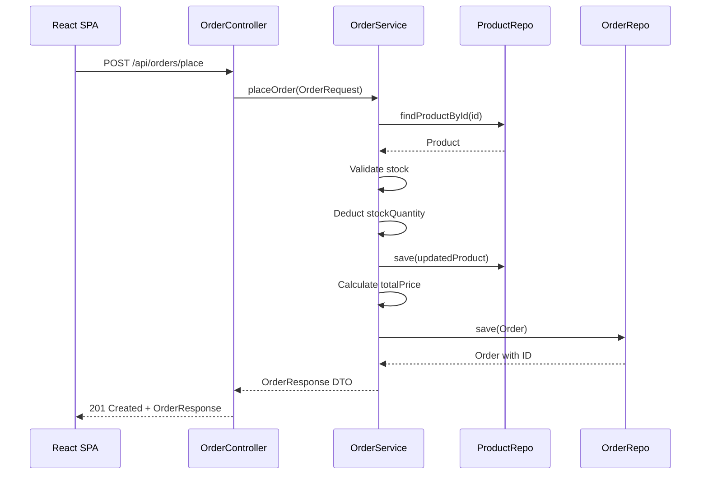

# 🛒 Spring-Ecommerce
 
**Full-stack e-commerce application** — Spring Boot 4.1 REST API + React frontend.
 
<p>
  
  
  
  
  
  
</p>
 
---
 
## 📋 Overview
 
A full-featured e-commerce API with a React SPA frontend. Clean layered architecture with DTO-based data transfer, managed entity relationships (@OneToMany / @ManyToOne), and full order lifecycle support.
 
**Backend (SpringEcom):**
- Full CRUD for products with image upload (multipart)
- Order placement with automatic stock deduction
- DTO-based API contracts (OrderRequest / OrderResponse)
- JPA entity relationships with cascading persistence
- Case-insensitive keyword search across 4 product fields
- CORS enabled for SPA integration
 
**Frontend (ebuy-frontend):**
- React 18 SPA with Vite
- Product listing, search, and cart
- Checkout flow with order history
- Add / update products with image upload
 
---
 
## 🏗️ Architecture
 
```
                        ┌─────────────────────────────┐
                        │        REST Client           │
                        │  (React SPA / Postman)       │
                        └─────────────┬───────────────┘
                                      │ HTTP / JSON (DTOs)
                                      ▼
┌─────────────────────────────────────────────────────────┐
│                    Controller Layer                      │
│  ┌────────────────────┐    ┌────────────────────┐       │
│  │ ProductController  │    │  OrderController   │       │
│  └─────────┬──────────┘    └─────────┬──────────┘       │
│            │                         │                  │
└────────────┼─────────────────────────┼──────────────────┘
             │                         │
             ▼                         ▼
┌─────────────────────────────────────────────────────────┐
│                     Service Layer                        │
│  ┌────────────────────┐    ┌────────────────────┐       │
│  │  ProductService    │    │   OrderService     │       │
│  │  - Business logic  │    │  - Order placement │       │
│  │  - Image handling  │    │  - Stock deduction │       │
│  │  - Search          │    │  - DTO mapping     │       │
│  └─────────┬──────────┘    └─────────┬──────────┘       │
└────────────┼─────────────────────────┼──────────────────┘
             │                         │
             ▼                         ▼
┌─────────────────────────────────────────────────────────┐
│                   Repository Layer                       │
│  ┌────────────────────┐    ┌────────────────────┐       │
│  │   ProductRepo      │    │    OrderRepo       │       │
│  │  (JPA + JPQL)      │    │      (JPA)         │       │
│  └─────────┬──────────┘    └─────────┬──────────┘       │
└────────────┼─────────────────────────┼──────────────────┘
             │                         │
             └───────────┬─────────────┘
                         │ JDBC
                         ▼
              ┌─────────────────────┐
              │     PostgreSQL      │
              │  Database: springecom│
              └─────────────────────┘
```
 
### Request Flow
 

 
---
 
## 🛠️ Tech Stack
 
| Layer | Technology |
|-------|------------|
| Language | Java 17 |
| Framework | Spring Boot 4.1.0 |
| ORM | Spring Data JPA / Hibernate |
| Database | PostgreSQL 16 |
| Frontend | React 18 + Vite |
| Build | Maven (backend) / npm (frontend) |
| Boilerplate | Project Lombok |
 
---
 
## 📁 Project Structure
 
```
E-comm final/
│
├── SpringEcom/                       # Backend REST API
│   ├── pom.xml
│   └── src/main/java/com/springcourse/springecom/
│       ├── SpringEcomApplication.java
│       ├── controller/
│       │   ├── ProductController.java
│       │   ├── OrderController.java
│       │   └── HelloController.java
│       ├── model/
│       │   ├── Product.java
│       │   ├── Order.java
│       │   ├── OrderItem.java
│       │   └── dtos/
│       │       ├── OrderRequest.java
│       │       ├── OrderResponse.java
│       │       ├── OrderItemRequest.java
│       │       └── OrderItemResponse.java
│       ├── repository/
│       │   ├── ProductRepo.java
│       │   └── OrderRepo.java
│       └── service/
│           ├── ProductService.java
│           └── OrderService.java
│
└── ebuy-frontend/                    # Frontend SPA
    ├── package.json
    ├── vite.config.js
    └── src/
        ├── App.jsx
        ├── axios.jsx
        ├── Context/Context.jsx
        └── components/
            ├── Home.jsx
            ├── Product.jsx
            ├── Cart.jsx
            ├── Order.jsx
            ├── Navbar.jsx
            ├── AddProduct.jsx
            ├── UpdateProduct.jsx
            ├── CheckoutPopup.jsx
            └── SearchResults.jsx
```
 
---
 
## 📊 Data Model
 
### Product
 
| Field | Type | JPA Mapping |
|-------|------|-------------|
| id | Integer | @Id @SequenceGenerator(name = "my_own_seq") |
| name | String | Product title |
| description | String | Product details |
| brand | String | Manufacturer |
| price | BigDecimal | — |
| category | String | Laptop, Mobile, Fashion |
| releaseDate | Date | JSON: dd-MM-yyyy |
| stockQuantity | int | Validated on checkout |
| productAvailable | boolean | Visibility toggle |
| imageData | byte[] | @Lob — stored as BLOB |
 
### Order
 
| Field | Type | JPA Mapping |
|-------|------|-------------|
| id | long | @Id @GeneratedValue |
| orderId | String | UUID |
| customerName | String | Buyer name |
| email | String | Buyer email |
| status | String | e.g. PLACED |
| orderDate | LocalDateTime | Auto-set on creation |
| items | List\<OrderItem\> | @OneToMany(cascade = ALL) |
 
### OrderItem
 
| Field | Type | JPA Mapping |
|-------|------|-------------|
| id | long | @Id @GeneratedValue |
| product | Product | @ManyToOne |
| quantity | int | Units ordered |
| totalPrice | BigDecimal | price x quantity |
| order | Order | @ManyToOne (LAZY fetch) |
 
---
 
## 🌐 API Endpoints
 
All endpoints prefixed with `/api`. CORS enabled globally.
 
### Products
 
| Method | Endpoint | Description | Request |
|--------|----------|-------------|---------|
| GET | /products | List all products | — |
| GET | /product/{id} | Get by ID | Path param |
| GET | /product/{id}/image | Get product image | Path param |
| POST | /product | Create product | Multipart (JSON + imageFile) |
| PUT | /product/{id} | Update product | Path param + Multipart |
| DELETE | /product/{id} | Delete product | Path param |
| GET | /products/search?keyword= | Search products | Query param |
 
### Orders
 
| Method | Endpoint | Description | Request |
|--------|----------|-------------|---------|
| GET | /orders | List all orders | — |
| POST | /orders/place | Place order | OrderRequest JSON |
 
### Order Request (JSON body)
 
```json
{
  "customerName": "Shubh Dubey",
  "email": "shubh@example.com",
  "items": [
    { "productId": 101, "quantity": 2 },
    { "productId": 102, "quantity": 1 }
  ]
}
```
 
### Order Flow
 

 
---
 
## ⚙️ Configuration
 
```properties
# Server
spring.application.name=SpringEcom
server.port=8080
 
# Database
spring.datasource.url=jdbc:postgresql://localhost:5432/springecom
spring.datasource.username=postgres
spring.datasource.password=your_password_here
spring.datasource.driver-class-name=org.postgresql.Driver
 
# JPA
spring.jpa.hibernate.ddl-auto=update
spring.jpa.show-sql=true
spring.jpa.properties.hibernate.format_sql=true
 
# File Upload
spring.servlet.multipart.max-file-size=30MB
spring.servlet.multipart.max-request-size=30MB
```
 
---
 
## 🚀 Getting Started
 
**Prerequisites:** Java 17+, PostgreSQL 16+, Node.js 18+
 
```bash
# 1. Clone
git clone https://github.com/shubhdubey1/spring-Ecommerce.git
cd "E-comm final"
 
# 2. Backend
cd SpringEcom
./mvnw spring-boot:run        # -> http://localhost:8080
 
# 3. Frontend (new terminal)
cd ebuy-frontend
npm install
npm run dev                   # -> http://localhost:5173
```
 
---
 
## 🧪 Testing
 
```bash
cd SpringEcom
./mvnw test
```
 
---
---
 
## 📸 Screenshots
 
> *Screenshots will be added after deployment. Below are placeholders for the key views.*
 
### Home Page — Product Grid
```


```
 
### Product Details
```


```
 
### Shopping Cart
```


```
 
### Checkout
```


```
 
### Order History
```


```
 
### Add / Update Product
```


```
 

 

 
```markdown

```
 
## 💡 Key Features
 
| Feature | Description |
|---------|-------------|
| DTO-based transfer | Clean API contracts (OrderRequest / OrderResponse) separate from JPA entities |
| Entity relationships | @OneToMany + @ManyToOne with cascading persistence |
| Custom JPQL search | Case-insensitive search across name, brand, description, category |
| Order orchestration | Automatic stock validation and deduction on order placement |
| Image upload | Multipart file handling with BLOB storage in PostgreSQL |
| CORS enabled | Cross-origin support for SPA integration |
| Layered architecture | Controller -> Service -> Repository, independently testable |
 
---
 
## 🚧 Future Improvements
 
- [ ] JWT / OAuth2 authentication
- [ ] Payment gateway (Razorpay, Stripe)
- [ ] Pagination for product listings
- [ ] Input validation with @Valid
- [ ] Docker Compose for one-command setup
- [ ] Integration tests with Testcontainers
 
---
 
## 🙌 Acknowledgements
 
- Backend concepts from the Telusko Spring Boot course
- Frontend UI refinements assisted by LLM; core logic and architecture implemented independently
 
---
 
## 👤 Author
 
**Shubh Dubey** — [@shubhdubey1](https://github.com/shubhdubey1)
 
---
 
## 📄 License
 
Open source for learning and portfolio purposes.
